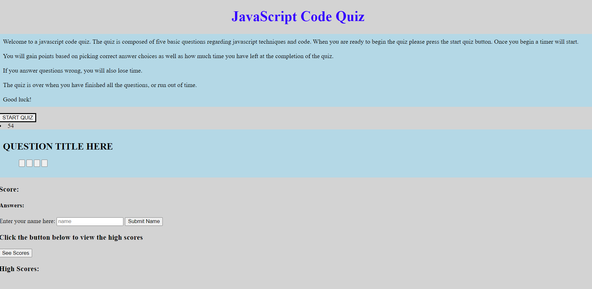
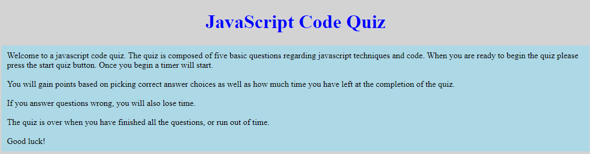
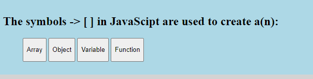
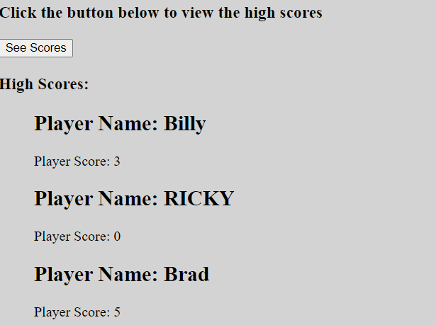

# code-quiz

## Project Description

This project is a short five question JavaScript Code-Quiz. A user will have 60 seconds to take the quiz. They will receive points
for answering questions correctly, but they will lose time if they answer a question incorrectly.

At the end of the quiz, a user will have the oppurtunity to submit their score and name. They will also have the oppurtunity to 
view other high scores.

## Tools Used to Create This Project

* HTML
* CSS
* JavaScript

## Link To Deployed Application

You can access the application at:

https://bsovic23.github.io/code-quiz/

## Future Work

* I would like to make the high score list more descriptive with:
    * Stats on most missed question and easiest question
    * Score stratifying by week, month, year
    * Multiple attempts have your scores grouped

* I would like to randomize the order in which questions are asked

* I would like to simplify the code to make it shorter rather than some of the sections that include more code than necessary

* I would like to have the high score list users in order of score

## Screenshots of the Application

